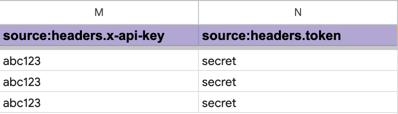
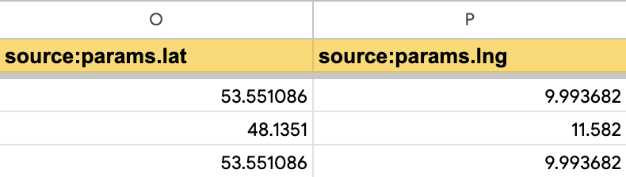
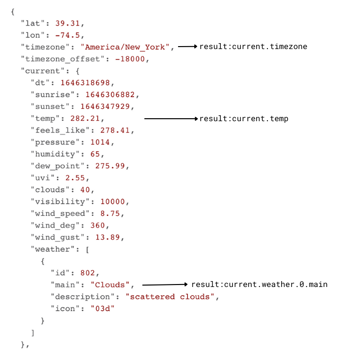
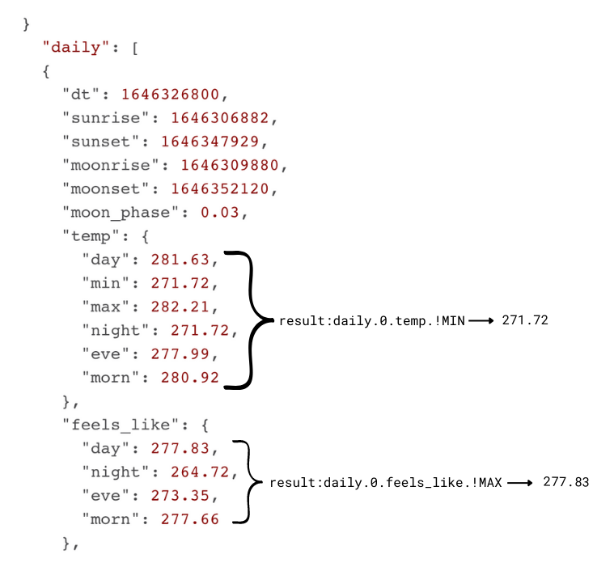
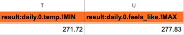

<!--
Copyright 2023 Google LLC

Licensed under the Apache License, Version 2.0 (the "License");
you may not use this file except in compliance with the License.
You may obtain a copy of the License at

      http://www.apache.org/licenses/LICENSE-2.0

Unless required by applicable law or agreed to in writing, software
distributed under the License is distributed on an "AS IS" BASIS,
WITHOUT WARRANTIES OR CONDITIONS OF ANY KIND, either express or implied.
See the License for the specific language governing permissions and
limitations under the License.
-->

# If This Then Ad (IFTTA)

[](https://github.com/google/if-this-then-ad)
[](https://github.com/google/if-this-then-ad)
[](https://github.com/google/if-this-then-ad/commits)

## Table of contents

- [Overview](#overview)
- [Getting Started](#getting-started)
- [How it works](#how-it-works)
- [How to run](#how-to-run)
- [Dynamic Column Notation](#dynamic-column-notation)
    - [Request Headers](#request-headers)
    - [Query Parameters](#query-parameters)
    - [API Result](#api-result)
- [Supported Target Agents](#supported-target-agents)
    - [DV360](#dv360)
    - [Google Ads](#google-ads)
- [Advanced use cases](#advanced-use-cases)
    - [Custom Evaluators](#custom-evaluators)
    - [Querying Multiple Sources](#querying-multiple-sources)
    - [Custom Result Parser](#custom-result-parser)
- [Developer Guide](#developer-guide)
    - [How to work with the code](#how-to-work-with-the-code)
    - [Application Flow](#application-flow)
    - [How to add a new Target Agent](#how-to-add-a-new-target-agent)
- [FAQ](#faq)

## Overview

IFTTA enables automatic management of marketing campaigns based on real world events.

It allows you to query data from virtually any JSON API and control entities in various campaign management tools (e.g. DV360 and Google Ads) in response to the results.

You can get very creative when using this tool and it's capabilities are only limited by your imagination. Here are some inspirations for what can be achieved:

- Enable a DV360 Line Item if it's sunny in London

- Pause Google Ads AdGroup whenever socks of SuperCompany goes below $X

- Enable all Google Ads that have the label 'performance' if it's raining AND pollen levels are above a certain level

Why would you want to do this?

- Control ads to reach their audience at the right time under the right circumstances
- Automate campaign management in response to real-time events
- Personalize ads and create a "WOW" effect for the end user side

* Show ads as targeted as possible to reach the right audience at the right time
* Manage ad campaigns in response to real-time events like weather, pollen data or air quality! This can be challenging or even impossible (imagine manually switching hundreds of ad groups every day - not only time consuming but also highly error-prone)

## Getting started

- A copy of the [Google Sheets Template](https://docs.google.com/spreadsheets/d/1EKcPGQ1Vr6LyyQYeYE0-T2gPzNhemVTxsvpSNC5arhE)
- Google Cloud Project with DV360 API and Ads API enabled
- Any JSON API to be used as data source
- An account for activation (see [Supported Target Agents](#supported-target-agents) below)

1. Create a [Google Cloud](https://console.cloud.google.com) project or re-use an existing one

1. Create an [OAuth Consent Screen](https://console.cloud.google.com/apis/credentials/consent)
    - Follow the instructions in the setup wizard

1. Enable the following APIs:
    - [Display & Video 360](https://console.cloud.google.com/apis/library/displayvideo.googleapis.com)
    - [Google Ads](https://console.cloud.google.com/apis/library/googleads.googleapis.com)

1. Make a copy of the [IFTTA Template](https://docs.google.com/spreadsheets/d/1EKcPGQ1Vr6LyyQYeYE0-T2gPzNhemVTxsvpSNC5arhE)

1. Choose a JSON API to be used as data source

1. Set up an account for activation (see [Supported Target Agents](#supported-target-agents) below)

1. Get creative with coming up with rules that suit your marketing needs ([guide](#how-it-works))

## How it works

The tool works with "Rules" which describe which source to check how often and which target to manage.

A rule consists of the following elements:

- **Rule Name**

  Arbitrary name of your choice for readability

- **Activation Formula**

  Any sheet formula that returns `TRUE` or `FALSE`. This would usually reference the API result fields (see below).

  For more complex evaluations, please see the section on "Custom Evaluator" below

- **Update Interval**

  Regularly the fetch and sync processes would be started automatically using an Apps Script `onOpen()` Trigger. This is the default behaviour with Update Interval = 0.

  However, if you would like to realize different intervals between different rules, you can specify them in this column. The number value in this column will be interpreted as "hours".

- **Target Info**

  Every Target Agent needs at least the following parameters:

  - **Target Identifier**

    This can be various things depending on the Agent. It may be a DV360 Line Item ID, a Google Ads Ad Group Label or something entirely different.

  - **Target ID Type**

    Because the Target Identifier is not one thing for all, the Target ID Type is required to tell the tool what it is working with

  - **Additional Parameters (optional)**

    Depending on the Target Agent additinal information may be required, such as an Advertiser ID, a Developer Token or other (check out [Supported Target Agents](#supported-target-agents) for details). You set them using the `target:` namespace (see [Dynamic Column Notation](#dynamic-column-notation))

- **Source Info**

  - **API URL**

    Provide the URL to the API you want to query via `source:url`

  - **Request Headers (optional)**

    If the API you're querying requires any headers to be set (e.g. for authentication), add a column for each one using "Dynamic Column Notation" `source:headers.<header name>` and specify the respective value in the corresponding cell in each row

  - **Query Parameters (optional)**

    If the API you're querying requires any query parameters, add a column for each one using "Dynamic Column Notation" `source:params.<param name>` and specify the respective value in the corresponding cell in each row

- **API Result Paths**

  To extract values from the queried API, add a column for each one using "Dynamic Column Notation" and the namespace `result:`. See [API Result](#api-result) for examples.

## How to run

You can trigger the tool either manually using the "IFTTA" Sheets menu or schedule an Apps Script Trigger to call `fetch()`, `sync()` or `fetchAndSync()` automatically, depending on your requirements.

## Dynamic Column Notation

To be as flexible as possible, IFTTA (Lite) uses "Dynamic Column Notation" to add API specific information like headers and query parameters and also to extract information from the request result.

### Request Headers

Using the column title `source:headers.<header name>` lets the tool know to add the respective cell in each row to the request header when querying the API

**Example:**



The resulting request header would be:

```json
{
  "x-api-key": "abc123",
  "x-debug": "my-value"
}
```

### Query Parameters

Encoding query parameters works very similar to request headers, the only difference being the prefix: `source:params`

**Example:**



The resulting url for the first row would look like this: `https://<base-url>?lat=53.551086&lng=9.993682`

### API Result

Similar to setting headers and parameters, the 'Dynamic Column Notation' can also be used to extract data from JSON API results. Using the 'dot notation' we can traverse the JSON result to get to the data point we want to extract.



Given the above JSON source we could add the following to our Sheet:


You can also get min and max values from an array like so:



Given the above JSON source we could add the following to our Sheet:



## Supported Target Agents

### DV360

**Required parameters**

- `target:advertiserId`

**Optional parameters**

- `target:serviceAccount`

### Google Ads

**Required parameters**

- `target:customerId`
- `target:developerToken`

**Optional parameters**

- `target:serviceAccount`

## Advanced use cases

### Custom Evaluators

In case you have rule conditions more complex than what a standard Sheets function could cover, you can easiily extend this by leveraging Apps Script's / Google Sheet's "Custom Functions".

**Example**

In the linked Apps Script, add another file `custom.gs` in which you can specify your custom evaluator.

**Example:**

```js
function customEvaluator(val1, val2) {
  return val1 === 123 && val2 < 3;
}
```

You can then reference this function in the "Activation Formula" cell of the respective row:

```
=customEvaluator(K3, L3)
```

(adjust for your actual function name and input cells)

Any time any of the referenced cells change, `customEvaluator()` will be called to process the update.

### Querying Multiple Sources

You can easily query multiple source APIs to built even more complex conditions by extending the Dynamic Column Notation with a group:

- `source:url` &rarr; `source.1.url`
- `source:params.lat` &rarr; `source.1:params.lat`

Add as many sources as you need by incrementing the group for each one.

To be able to access the correct API result for evaluation, the respective group is used again for reference:

- `result:current.temp` &rarr; `result.1:current.temp`
- `result:current.weather.1.main` &rarr; `result.1:current.weather.1.main`

### Custom Result Parser

IFTTA is designed to be as flexible as possible to cover just about any use case you could come up with for dynamic marketing. If by any chance you should encounter that JPath is not sufficient to extract the information from API results that you require, IFTTA has another ace up its sleeve: Custom Result Parser!

Analogue to a Custom Evaluator, to use a Custom Result Parser, you first need a custom function. You're free to (re-)use the `custom.gs` or any other file you like. In this file you add a function with a name of your choosing:

**Example:**

```js
/**
 * Parse and process JSON result.
 *
 * @param {Object} data
 * @param {Object} params
 * @returns {string}
 */
function customParser(data, params) {
  return 'result';
}
```

The function's return value will be written to the corresponding cell cell in each row.

To call this function, just add another column with the heading: `result:!CUSTOM.customParser`.

If you need any parameters passed to the Custom Parser, you can add those using another column and the heading: `customParser:<parameterName>`. Put the values in the corresponding cells of each row. Add as many columns as you need parameters. The parameters will be passed to the Custom Parser in the following format:

```js
{
  parameter1: 'value',
  parameter2: 'another value'
}
```

## Developer Guide

### How to work with the code

1. Make sure Node and npm are installed

1. Clone this repository

    ```
    git clone https://github.com/google/if-this-then-ad.git 
    ```

1. Move into the repo folder

    ```
    cd if-this-then-ad/
    ```

1. Install dependencies

    ```
    npm i
    ```

1. Authenticate clasp (if not already done before)

    ```
    clasp login
    ```

1. Build Apps Script target code

    This will transpile TypeScript to JavaScript and finally bundle everything into `dist/index.js`
    ```
    npm run build
    ```

1. Create Google Sheet to deploy to

    ```
    clasp create --type sheets --title IFTTA-dev --rootDir ./dist && mv ./dist/.clasp.json .clasp-dev.json
    ```

1. Deploy

    This will run all tests, transpile TypeScript to JavaScript, bundle everything into `dist/index.js` and finally deploy it with clasp

    ```
    npm run deploy
    ```

### Application Flow

Here's a high level overview of what's happening under the hood:

#### Fetch

- Call `main()` in `src/index.ts` with `MODE.FETCH` (or `MODE.FETCH_AND_SYNC`)

- Load the entire feed from Sheet and iterate over it row-by-row

- Check if row is due for update

- Extract Source parameters using 'Dynamic Column Notation'

- Call API URL for each source

- Update the row data accordingly

- Write back to Sheet

#### Sync

- Call `main()` in `src/index.ts` with `MODE.SYNC` (or `MODE.FETCH_AND_SYNC`)

- Load the entire feed from Sheet and iterate over it row-by-row

- Check if row is due for update

- Read the result of the Activation Formula

- Extract Target parameters

- Select the corresponding Target Agent

- Call `process()` on the Target Agent to handle updating the specified Target Entity

- Update the row data accordingly

- Write back to Sheet

#### Validate

- Call `main()` in `src/index.ts` with `MODE.SYNC` (or `MODE.FETCH_AND_SYNC`)

- Load the entire feed from Sheet and iterate over it row-by-row

- Read the result of the Activation Formula (supposed state)

- Extract Target parameters

- Select the corresponding Target Agent

- Call `validate()` on the Target Agent to handle checking actual Entity state against the supposed state

- Output any errors in case of mismatch

### How to add a new Target Agent

Here's what you need to include a new Target Agent:

1. Use `src/target-agents/agent.sample.ts` as a template for the Target Agent class
1. Set a `friendlyName` of your choice
1. Define `requiredParameters` (optional)
1. Implement the `process()` function
1. Implement the `validate()` function (optional)
1. Add your new Target Agent class to the array in `src/target-agents/index.ts`
1. Deploy your code
1. Update data validation for 'Target Agent' and 'target:type' in the Sheet (optional)

## FAQ

### I don't have a Google Ads Developer Token (yet). Can I still use IFTTA?

While we recommend applying for a Developer Token for the integration to work "natively", it is also possible to separate the fetching and activation part so that you only query the API with IFTTA to then read and process the results using an Ads Script in your Ads account.

For more information please refer to the [Google Ads Scripts Extension Documentation](src/external/ads-script/README.md)
