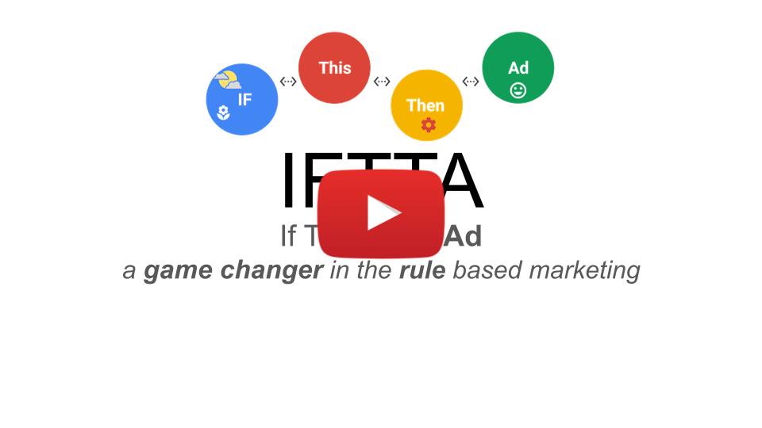

<!--
    Copyright 2022 Google LLC
    Licensed under the Apache License, Version 2.0 (the "License");
    you may not use this file except in compliance with the License.
    You may obtain a copy of the License at
        https://www.apache.org/licenses/LICENSE-2.0
    Unless required by applicable law or agreed to in writing, software
    distributed under the License is distributed on an "AS IS" BASIS,
    WITHOUT WARRANTIES OR CONDITIONS OF ANY KIND, either express or implied.
    See the License for the specific language governing permissions and
    limitations under the License.
 -->

# If This Then Ad (IFTTA)

")
YouTube Link: [youtu.be/ugklLFbij-A](https://youtu.be/ugklLFbij-A).

IFTTA is a game changer in **rule-based marketing**. With our tool you can run marketing campaigns based on real world events.
We already support the following data sources:
* Weather (based on [OpenWeatherMaps API](https://openweathermap.org/)). The Weather conditions that you already can use: temperature, wind speed, cloudiness, rain, snow, thunderstorm.
* Pollen and Air Quality ([Ambee API](https://www.getambee.com/)).

On the marketing activation side we support the following platforms:
* [DV360](https://marketingplatform.google.com/intl/de/about/display-video-360/) (via the [DV360 API](https://developers.google.com/display-video/api/reference/rest))
* [Google Ads](https://ads.google.com/) (via the [Ads API](https://developers.google.com/google-ads/api/docs/release-notes))

*Keywords: Weather Based Marketing, External Signal Based Marketing, Pollen Based Marketing, AirQuality Based Marketing, Rule-based Marketing.*

## The Problem that we solve
* Advertisers want to show their ads as targeted as possible to reach the right audience at the right time
* Managing ad campaigns in response to real-time events like weather, pollen data or air quality can be challenging to impossible (just imagine, manually switching hundreds of ad groups on a daily basis... it is really time consuming and an error-prone)

Our tool will do this for you automatically!

## Is IFTTA for you?
Basically all advertisers can benefit from this solution and especially those that clearly see a correlation between the real world factors (e.g. weather) and sales (or other marketing KPIs).

Some examples to ignite the imagination (based on our experience):
* Hot beverages can be advertised during the colder weather and cold beverages during the warm weather
* An ice cream company can show ads when it’s hot
* Insurance companies can show ads when there’s a storm or a flood
* A hardware store might show ads for snow shovels when it snowed
* Healthcare companies can advertise based on the pollen index and/or the air quality

## Benefits you get
* Ads will reach their audience at the right time under the right circumstances
* Advertisers can automate their campaign management in response to real-time events
* Personalized ads and WOW effect on the end user side (since the user will see the right ad at the right time)

## Setup
### Prerequisities
Basic Google Cloud knowledge and a Google Cloud project with [enabled billing](https://cloud.google.com/billing/docs/how-to/modify-project) are required.

### Step-by-step guide
With the following simple steps you can install IFTTA on your [Google Cloud](https://cloud.google.com/resource-manager/docs/creating-managing-projects) project.
The installation below is partly automated, this means that you will need to do some manual steps at the beginning and at the end the installation script (the big blue button below) will do the rest.

1. Create an [OAuth Consent Screen](https://console.cloud.google.com/apis/credentials/consent)

1. Make it of type "**External**"

1. Add all users you want to have access to the app

1. Create an [OAuth Client ID](https://console.cloud.google.com/apis/credentials/oauthclient)

1. Set Application type to "**Web application**"

1. Set the name to "**if-this-then-ad**"

1. Take note of the **Client ID** and **Client Secret** presented to you

1. Click the big blue button to deploy:

   

1. Choose the Google Cloud Project where you want to deploy the app

1. Select the region where you want to deploy

1. Enter your Client ID and Client Secret when prompted

1. Ignore any other prompts, which will get auto-populated

1. Make sure you add the **Authorized JavaScript origin** as well as the **Authorized redirect URI** presented to you at the end of the script to your OAuth Client

## Reporting bugs / feature requests

We love to hear your feedback! Please [create an issue](https://github.com/google/if-this-then-ad/issues/new) directly on GitHub. Please be **specific** describing your question/bug/feature.

## Development

### Git: Pre commit

To do all the checks before the commit automatically please add the [git/pre-commit](git/pre-commit) to your `.git/hooks/` directory. The easiest way would be to create a soft link: `cd .git/hooks/; ln -sf ../../git/pre-commit`.

To run all checks manually you can execute the following code from the project root:

- For server: `cd server; npm run pre-commit`.
- For client: `cd client; npm run pre-commit`.

# Do you like our tool?
You can start contributing by sending pull requests right now!
Also you can give us a star on our [GitHub page](https://github.com/google/if-this-then-ad) ;-)

# Troubleshooting
## Authorization Error (redirect_uri_mismatch)
This usually originates from not having the **Authorized redirect URI** set properly.
To do that:
1. Go to [Cloud Credentials](https://console.cloud.google.com/apis/credentials)
1. Select the right project
1. Click on the **if-this-then-ad** OAuth 2.0 Client ID
1. Add the redirect_uri presented to you in the error message to **Authorized redirect URIs**
